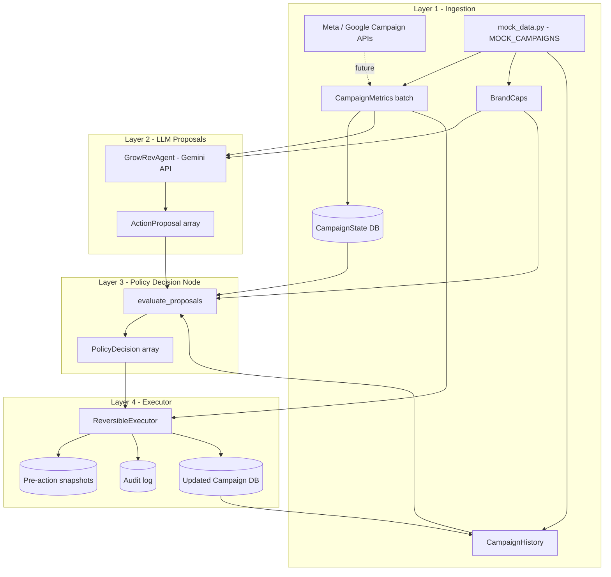
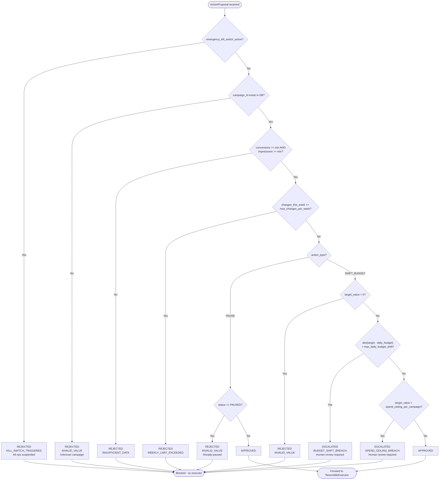
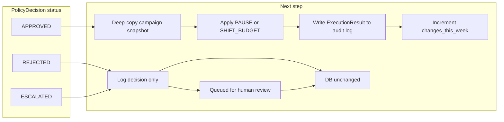
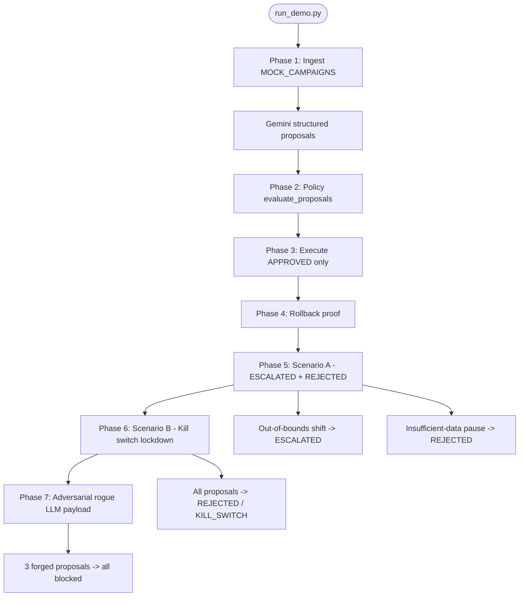

# GrowRev Data Flow & Decision Pipeline

This document describes how campaign data moves through the GrowRev control loop, with explicit branching inside the **Policy Decision Node** (`policy_engine.py`).

**Core rule:** The LLM never touches money. It outputs structured proposals only. All money-moving paths require deterministic policy approval.

---

## End-to-End Pipeline



---

## Layer-by-Layer Data Contracts

| Layer | Input | Output | Mutates state? |
|-------|-------|--------|----------------|
| **1 — Ingestion** | Raw platform metrics | `CampaignMetrics[]`, `BrandCaps`, `CampaignHistory`, `CampaignState` DB | Seeds DB only |
| **2 — LLM** | Metrics + caps context | `ActionProposal[]` | No |
| **3 — Policy** | Proposals + caps + DB + history | `PolicyDecision[]` with status + violation code | No (read-only deep copy) |
| **4 — Executor** | Approved decisions + metrics | `ExecutionResult`, updated DB, audit log | Yes (approved only) |

---

## Policy Decision Node — Full Branching Logic

Each incoming `ActionProposal` is evaluated independently. The policy node deep-copies all inputs before evaluation and never mutates the live DB or history.



---

## Branch Outcomes — What Happens Next



| Status | Violation codes | Executor called? | DB mutated? | Rollback available? |
|--------|-----------------|------------------|-------------|---------------------|
| `APPROVED` | — | Yes | Yes | Yes (`rollback(action_id)`) |
| `REJECTED` | `KILL_SWITCH_TRIGGERED`, `INSUFFICIENT_DATA`, `WEEKLY_LIMIT_EXCEEDED`, `INVALID_VALUE` | No | No | N/A |
| `ESCALATED` | `BUDGET_SHIFT_BREACH`, `SPEND_CEILING_BREACH` | No | No | N/A |

---

## Demo Pipeline Phases (`run_demo.py`)

The demo script exercises every branch of the money trust boundary:



---

## Example Flow — Mock Campaign `camp_003` (Winner)

```
INGEST     camp_003: CPA $18, 228 conv, 120k impr, budget $500
    |
    v
LLM        SHIFT_BUDGET -> target $700 (+$200 rationale: low CPA winner)
    |
    v
POLICY     shift $200 <= max $500  -->  APPROVED
    |
    v
EXECUTOR   snapshot saved  -->  daily_budget: $500 -> $700  -->  audit log entry
    |
    v
ROLLBACK   (optional) restore snapshot  -->  daily_budget back to $500
```

## Example Flow — Adversarial Rogue Proposal

```
INGEST     camp_003: budget $500
    |
    v
LLM        SHIFT_BUDGET -> target $50,500  (rogue / hallucinated)
    |
    v
POLICY     shift $50,000 > max $500  -->  ESCALATED / BUDGET_SHIFT_BREACH
    |
    x
EXECUTOR   (skipped)  -->  DB unchanged
```

## Example Flow — Kill Switch Active

```
INGEST     4 legitimate proposals (2 PAUSE, 2 SHIFT_BUDGET)
    |
    v
POLICY     emergency_kill_switch_active = True
    |        -->  ALL proposals REJECTED / KILL_SWITCH_TRIGGERED
    x
EXECUTOR   (skipped)  -->  all campaigns remain ACTIVE, budgets unchanged
```

---

## Source File Map

| File | Role in pipeline |
|------|------------------|
| [`growrev/mock_data.py`](growrev/mock_data.py) | Ingestion seed data, `BrandCaps`, initial DB |
| [`growrev/models.py`](growrev/models.py) | All data contracts and `ViolationType` enum |
| [`growrev/llm_agent.py`](growrev/llm_agent.py) | Gemini structured proposal generation |
| [`growrev/test_pipeline.py`](growrev/test_pipeline.py) | Gemini integration test on fixture data |
| [`growrev/policy_engine.py`](growrev/policy_engine.py) | Decision node — all branching logic |
| [`growrev/executor.py`](growrev/executor.py) | Approved-action execution + rollback |
| [`growrev/run_demo.py`](growrev/run_demo.py) | Full pipeline orchestration and adversarial tests |
