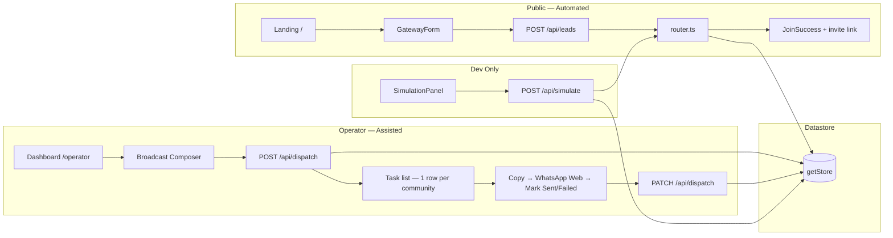
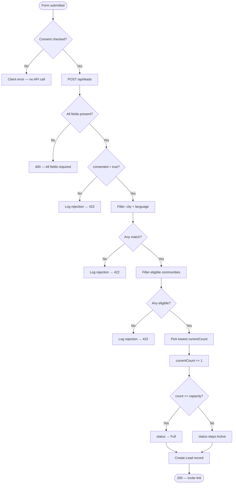
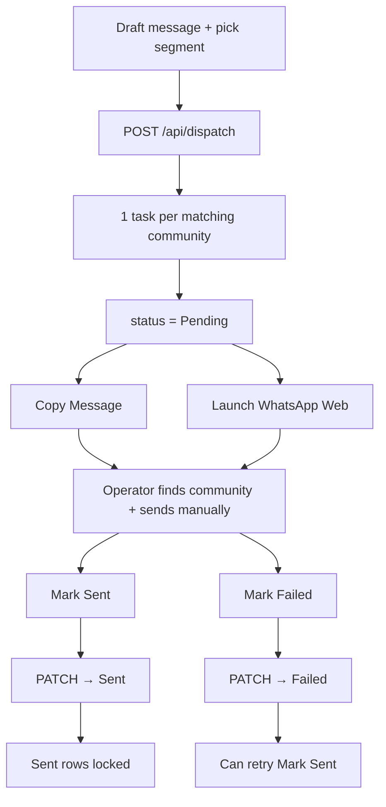

# Atlas Travels — How It Works (End-to-End)

Complete product guide for **Project C** (`proj3`): the Atlas Travels WhatsApp Community Gateway MVP. This document explains every flow, actor, API, and scenario the prototype handles.

**Core compliance rule:** There is no official WhatsApp Communities API. This build automates **routing** and **task generation** only. **Community creation** and **message broadcasting** are human-in-the-loop workflows — no browser bots, scrapers, or unofficial WhatsApp automation.

---

## Table of contents

1. [Product overview](#product-overview)
2. [System architecture](#system-architecture)
3. [Data model](#data-model)
4. [Pipeline 1 — Public gateway (lead routing)](#pipeline-1--public-gateway-lead-routing)
5. [Routing scenarios (all cases)](#routing-scenarios-all-cases)
6. [Pipeline 2 — Operator dispatch (broadcasts)](#pipeline-2--operator-dispatch-broadcasts)
7. [Dispatch scenarios (all cases)](#dispatch-scenarios-all-cases)
8. [Pipeline 3 — Dev simulation](#pipeline-3--dev-simulation)
9. [API reference](#api-reference)
10. [End-to-end user journeys](#end-to-end-user-journeys)
11. [What's mocked vs production](#whats-mocked-vs-production)
12. [Source file map](#source-file-map)

---

## Product overview

Atlas Travels (Hajj & Umrah) runs many private WhatsApp Communities segmented by **city** and **language**. Instead of publishing dozens of invite links, they use **one smart gateway URL**.

| Actor | Goal | MVP support |
|-------|------|-------------|
| **Pilgrim / lead** | Join the right community for their city & language | Public form → deterministic router → native WhatsApp invite link |
| **Atlas operator** | Broadcast one message to many communities safely | Compose message → task list (one row per community) → manual send → mark status |
| **Admin / evaluator** | Prove capacity limits and compliance boundary | Dev simulation panel + rejection audit log |

### URLs

| URL | Purpose |
|-----|---------|
| `http://localhost:3001` | Public gateway (landing + join form) — proj3 dev server |
| `http://localhost:3001/operator` | Operator control center |
| `pipeline_flowchart.html` | Visual Mermaid diagrams (open in browser) |

> **Port note:** Next.js defaults to `3000`, but if another app (e.g. proj2) is already on that port, proj3 runs on **`3001`**. Check the terminal output from `npm run dev` for the actual port.

### Quick start

```bash
cd proj3
npm install
npm run dev
```

---

## System architecture

Three parallel flows share one **in-memory datastore** (`src/lib/datastore.ts`), seeded from `src/data/seed.json`. All state **resets when the Next.js server restarts**.



### Compliance boundary

| Automated (compliant) | Assisted / manual (required) | Not in this build |
|----------------------|-------------------------------|-------------------|
| Landing form + consent capture | Creating WhatsApp Communities | Browser bots / scrapers |
| Segment + capacity router | Copy message → send in WhatsApp Web | Auto-creating communities |
| Lead + rejection logging | Proxy vs real count reconciliation | Auto-broadcasting |
| Dispatch task generation | Mark Sent / Failed per row | Reading live WhatsApp member counts |

---

## Data model

### Community

```ts
{
  id, name, city, language,
  proxyCapacity,   // max proxy members before "Full"
  currentCount,    // routed-user proxy count (NOT live WhatsApp count)
  inviteLink,      // native WhatsApp invite URL
  status           // 'Active' | 'Full' | 'Privacy Risk'
}
```

### Lead

```ts
{
  id, name, phone, city, language,
  consented,           // must be true to route
  routedCommunityId,   // set on success; null on rejection
  timestamp
}
```

### DispatchTask

```ts
{
  id, messageText,
  targetSegment,   // e.g. "city:Mumbai" or "language:Hindi"
  status,          // 'Pending' | 'Sent' | 'Failed'
  communityId, createdAt
}
```

### RejectedRoutingAttempt

```ts
{
  id, name, phone, city, language,
  reason, timestamp
}
```

### Seed communities (starting state)

| Community | City | Language | Count / Capacity | Status | Demo role |
|-----------|------|----------|------------------|--------|-----------|
| Atlas Mumbai — Hajj & Umrah (Hindi) | Mumbai | Hindi | 28 / 50 | Active | Primary Mumbai segment |
| Atlas Mumbai — Umrah Pilgrims (Hindi) | Mumbai | Hindi | 12 / 40 | Active | Fallback when primary fills |
| Atlas Delhi — Hajj Community (Urdu) | Delhi | Urdu | 19 / 45 | Active | Urdu segment |
| Atlas Hyderabad — Umrah Group (Telugu) | Hyderabad | Telugu | 8 / 35 | Active | Telugu segment |
| Atlas Chennai — Hajj Pilgrims (Tamil) | Chennai | Tamil | 30 / 30 | **Full** | Always skipped |
| Atlas Bangalore — Umrah Community (Kannada) | Bangalore | Kannada | 14 / 25 | **Privacy Risk** | Always skipped |

The form offers **7 cities** and **7 languages**, but only **6 communities** exist in seed data. Unmatched city/language combinations always fail gracefully.

**Cities:** Mumbai, Delhi, Hyderabad, Chennai, Bangalore, Lucknow, Kolkata  
**Languages:** Hindi, Urdu, English, Tamil, Telugu, Kannada, Bengali

---

## Pipeline 1 — Public gateway (lead routing)

### Step-by-step flow

1. User opens **`/`** — branded Atlas Travels Hajj & Umrah landing page.
2. User fills **GatewayForm**: Full Name, WhatsApp Number, City, Language.
3. User must check the **consent checkbox** (mandatory opt-in for compliance).
4. **Client-side check:** If consent is unchecked, form shows an error and never calls the API.
5. Form submits **`POST /api/leads`** with `{ name, phone, city, language, consented }`.
6. API validates required fields; trims name and phone.
7. **`routeLead()`** in `src/lib/router.ts` runs deterministically.
8. **On success (200):** UI switches to **JoinSuccess** — community name + **Join WhatsApp Community** button (`inviteLink`).
9. **On failure (422):** Inline error on the form; rejection logged to `rejectedRoutingAttempts`.
10. User taps invite link → WhatsApp opens natively → user joins manually (outside the app).



### Routing rules

| Rule | Value | Where |
|------|-------|-------|
| Segment match | Exact `city` + `language` (case-insensitive) | `router.ts` |
| Capacity buffer | `5` | `PROXY_CAPACITY_BUFFER` in `constants.ts` |
| Eligible threshold | `currentCount < proxyCapacity - 5` | `isEligible()` |
| Skipped statuses | `Full`, `Privacy Risk` | `isEligible()` |
| Best match | Lowest `currentCount` among eligible | Load balancing |
| Auto-mark Full | When `currentCount >= proxyCapacity` after increment | `routeLead()` |

**Capacity thresholds from seed data:**

- Mumbai Hajj (50 cap): accepts until count **44** (50 − 5), then ineligible
- Mumbai Umrah (40 cap): accepts until count **35** (40 − 5)
- Chennai (Full, 30/30): never eligible regardless of count
- Bangalore (Privacy Risk): never eligible regardless of count

---

## Routing scenarios (all cases)

### Scenario A — Successful route (single match)

**Input:** Delhi + Urdu, consent ✓  
**Matching communities:** 1 (Delhi Hajj Community)  
**Eligible:** Yes (19 < 40)  
**Result:** Routed to `comm-delhi-urdu-01`, count 19 → 20, lead logged, invite link returned.

---

### Scenario B — Successful route (multiple matches, load balancing)

**Input:** Mumbai + Hindi, consent ✓  
**Matching communities:** 2 (both Active)  
**Eligible:** Both (28 < 45, 12 < 35)  
**Selection:** `comm-mumbai-hindi-02` wins — lower count (12 vs 28)  
**Result:** Count 12 → 13, lead logged, invite link for Mumbai Umrah Pilgrims returned.

This is the default happy path for the most common demo segment.

---

### Scenario C — Successful route (Hyderabad Telugu)

**Input:** Hyderabad + Telugu, consent ✓  
**Matching communities:** 1  
**Eligible:** Yes (8 < 30)  
**Result:** Routed to `comm-hyderabad-telugu-01`, count 8 → 9.

---

### Scenario D — Fallback when primary community fills

**Input:** Mumbai + Hindi (repeated submissions)  
**Behaviour:**

1. Router always picks the community with the **lowest** `currentCount`.
2. As `comm-mumbai-hindi-02` fills (approaches 35), traffic shifts to `comm-mumbai-hindi-01`.
3. When **both** are at or above `proxyCapacity - 5`, routing fails → Scenario F.

Use the dev **Simulate Capacity Overflow** button to inject 10 dummy Mumbai/Hindi leads and observe fallback + rejections.

---

### Scenario E — Rejection: consent not provided (client-side)

**Input:** Any city/language, consent checkbox unchecked  
**Result:** Client error *"You must agree to receive WhatsApp community updates."* — **no API call**.

---

### Scenario F — Rejection: consent not provided (server-side)

**Input:** API called with `consented: false` (e.g. direct API call)  
**Result:**

- HTTP **422**
- Error: *"Consent is required to join a community."*
- Rejection logged: *"Consent not provided — routing blocked for compliance"*
- No lead created, no counter incremented

---

### Scenario G — Rejection: no community for segment

**Input:** Any unmatched combo, e.g. Lucknow + Bengali, Mumbai + English, Kolkata + Hindi  
**Result:**

- HTTP **422**
- Error: *"No community available for {city} ({language}). Our team will contact you shortly."*
- Rejection logged: *"No community found for {city} / {language}"*

---

### Scenario H — Rejection: all matching communities at capacity

**Input:** Mumbai + Hindi — after both communities hit `currentCount >= proxyCapacity - 5`  
**Result:**

- HTTP **422**
- Error: *"All communities in your segment are currently full. Please try again later or contact Atlas Travels support."*
- Rejection logged: *"All matching communities at or near proxy capacity"*
- No community selected; proxy counters unchanged for this attempt

---

### Scenario I — Rejection: community marked Full

**Input:** Chennai + Tamil, consent ✓  
**Matching communities:** 1 (Chennai Hajj Pilgrims)  
**Status:** `Full` (30/30)  
**Result:** Skipped by `isEligible()` → falls through to Scenario H (no eligible communities).

---

### Scenario J — Rejection: community flagged Privacy Risk

**Input:** Bangalore + Kannada, consent ✓  
**Matching communities:** 1 (Bangalore Umrah Community)  
**Status:** `Privacy Risk` (14/25 would otherwise fit)  
**Result:**

- Community skipped regardless of count
- Rejection logged: *"Matching communities flagged Privacy Risk — routing suspended"*
- HTTP **422** with full-segment error message

**Product intent:** Operator flags a community when member visibility or moderation issues arise; router stops sending new leads until manually resolved.

---

### Scenario K — Auto-promotion to Full after successful route

**Input:** Any eligible community where increment pushes `currentCount >= proxyCapacity`  
**Behaviour:**

- Route **succeeds** (increment happens first)
- Community `status` set to **`Full`**
- Subsequent leads for that segment skip this community

**Example:** Hyderabad at 34/35 routes one more user → count 35, status → Full.

---

### Scenario L — Invalid or missing form fields

**Input:** Empty name, phone, city, or language  
**Result:**

- HTTP **400** — *"All fields are required."*
- No routing attempted, nothing logged

Note: HTML `required` attributes also block empty submits in the browser before the API is called.

---

### Scenario M — Malformed request / network error

**Input:** Invalid JSON body, or network failure during fetch  
**Result:**

- API: HTTP **400** — *"Invalid request."*
- UI: *"Something went wrong. Please try again."*
- No routing attempted

---

### Scenario N — Register another person

**Input:** User clicks **Register another person** on JoinSuccess screen  
**Result:** Form resets; user can submit another lead (each successful route increments proxy count again).

---

### Routing outcome summary

| Scenario | HTTP | Lead created | Counter changed | Rejection logged |
|----------|------|--------------|-----------------|------------------|
| A — Single match success | 200 | ✓ | ✓ | — |
| B — Multi-match load balance | 200 | ✓ | ✓ (lowest count) | — |
| C — Hyderabad Telugu | 200 | ✓ | ✓ | — |
| D — Fallback to alternate | 200 | ✓ | ✓ (other community) | — |
| E — No consent (client) | — | — | — | — |
| F — No consent (server) | 422 | — | — | ✓ |
| G — No segment match | 422 | — | — | ✓ |
| H — All at capacity | 422 | — | — | ✓ |
| I — Full status skipped | 422 | — | — | ✓ |
| J — Privacy Risk skipped | 422 | — | — | ✓ |
| K — Auto-mark Full | 200 | ✓ | ✓ + status → Full | — |
| L — Invalid payload | 400 | — | — | — |
| M — Malformed / network | 400 / UI error | — | — | — |
| N — Register another | 200 (per submit) | ✓ | ✓ | — |

---

## Pipeline 2 — Operator dispatch (broadcasts)

### Step-by-step flow

1. Operator opens **`/operator`** — Operator Control Center.
2. Operator drafts a **message template** in Broadcast Composer.
3. Operator selects segment filter: **By City** or **By Language**, then picks a value.
4. Operator clicks **Generate Operator Task List** → **`POST /api/dispatch`**.
5. **`createDispatchTasks()`** finds all matching communities, creates **one Pending task per community**, sorted alphabetically by name.
6. Task list loads via **`GET /api/dispatch`** (also called on page mount).
7. For each task row, operator:
   - Sees community name + proxy count / capacity + status badge if not Active
   - Clicks **Copy Message** → clipboard
   - Clicks **Launch WhatsApp** → opens `https://web.whatsapp.com/send?text=…` with pre-filled message text
   - **Manually navigates to the target community** in WhatsApp Web and sends (outside the app)
   - Clicks **Mark Sent** or **Mark Failed**
8. Status update → **`PATCH /api/dispatch`** → row refreshes with visual feedback.



**Important:** Launch WhatsApp opens a generic send URL with the message pre-filled — it does **not** deep-link into a specific community. The operator must open the correct community manually.

**Dispatch does NOT filter by Active/Full/Privacy Risk** — all communities matching the city or language segment get a task. Operators may still need to message a Full community for existing members.

---

## Dispatch scenarios (all cases)

### Scenario O — Broadcast by city (Mumbai)

**Input:** Message + `segmentType: "city"`, `targetSegment: "Mumbai"`  
**Matching communities:** 2 (both Mumbai Hindi communities, all statuses)  
**Tasks created:** 2 rows — Mumbai Hajj & Umrah + Mumbai Umrah Pilgrims

---

### Scenario P — Broadcast by language (Hindi)

**Input:** Message + `segmentType: "language"`, `targetSegment: "Hindi"`  
**Matching communities:** 2 (both Mumbai Hindi communities)  
**Tasks created:** 2 rows

---

### Scenario Q — Broadcast by city (Delhi)

**Input:** Message + city filter `Delhi`  
**Tasks created:** 1 row — Delhi Hajj Community (Urdu)

---

### Scenario R — Broadcast includes Full / Privacy Risk communities

**Input:** City filter `Chennai` or `Bangalore`  
**Result:** Tasks created for those communities even though routing would skip them. Operator sees status badge `(Full)` or `(Privacy Risk)` on the row.

---

### Scenario S — Broadcast with no matching communities

**Input:** Message + language filter `Bengali` (or city `Lucknow`)  
**Matching communities:** 0  
**Tasks created:** Empty list — operator sees *"No dispatch tasks yet."*

---

### Scenario T — Mark Sent (success path)

**Action:** Operator clicks **Mark Sent** on a Pending task  
**Result:** Status → `Sent`, row dimmed, **Mark Sent / Mark Failed disabled**  
**Duplicate prevention:** Once Sent, status cannot change to Failed

---

### Scenario U — Mark Failed

**Action:** Operator clicks **Mark Failed** on a Pending task  
**Result:** Status → `Failed`  
**Use case:** WhatsApp Web failed, wrong community, message rejected by admin

---

### Scenario V — Retry after Failed

**Action:** Operator clicks **Mark Sent** on a Failed task  
**Result:** Status → `Sent` (allowed — only Sent → Failed is blocked)

---

### Scenario W — Attempt to change Sent → Failed

**Action:** PATCH with `status: "Failed"` on already-Sent task  
**Result:** Status unchanged (locked), HTTP 200 with unchanged task — idempotent guard in `updateTaskStatus()`

---

### Scenario X — Task not found

**Action:** PATCH with invalid `taskId`  
**Result:** HTTP **404** — *"Task not found."*

---

### Scenario Y — Invalid dispatch payload

**Input:** Empty message or empty target segment  
**Result:** HTTP **400** — *"Message and target segment are required."*

---

### Scenario Z — Multiple broadcasts accumulate

**Behaviour:** Each compose action **prepends** new tasks to `dispatchTasks`. Previous Sent/Failed tasks remain in the list for audit. Counters show Pending / Sent / Failed totals.

---

### Dispatch outcome summary

| Scenario | Tasks created | Operator action | Final status |
|----------|---------------|-----------------|--------------|
| O — City filter (Mumbai) | 1 per matching community | Manual send | Sent / Failed |
| P — Language filter (Hindi) | 1 per matching community | Manual send | Sent / Failed |
| Q — City filter (Delhi) | 1 | Manual send | Sent / Failed |
| R — Full / Privacy Risk included | 1 per match | Manual send | Sent / Failed |
| S — No match | 0 | — | — |
| T — Mark Sent | — | Click Mark Sent | Sent (locked) |
| U — Mark Failed | — | Click Mark Failed | Failed |
| V — Retry Failed → Sent | — | Click Mark Sent | Sent |
| W — Re-mark Sent task | — | Blocked | Sent (unchanged) |
| X — Invalid taskId | — | PATCH | 404 |
| Y — Invalid payload | 0 | — | 400 |
| Z — Repeat broadcast | New tasks prepended | Per row | Mixed |

---

## Pipeline 3 — Dev simulation

Visible on **`/operator`** only when `NODE_ENV === "development"` (fixed sidebar on large screens).

### Scenario AA — Simulate Capacity Overflow

**Action:** Click **Simulate Capacity Overflow**  
**API:** `POST /api/simulate` with `{ city: "Mumbai", language: "Hindi", count: 10 }`  
**Behaviour:**

1. Registers 10 dummy leads (`SimUser 1` … `SimUser 10`) through the real `routeLead()` function.
2. Each routes to lowest-count eligible community (typically `comm-mumbai-hindi-02` first).
3. When both Mumbai Hindi communities hit capacity threshold, remaining attempts reject.
4. Panel shows **routed / rejected counts** and live **Rejected Routing Log** (last 20 rejections).

**Production:** `POST /api/simulate` and `GET /api/simulate` return **403** — disabled outside development.

### Scenario AB — View rejection log

**Action:** Panel loads on mount via `GET /api/simulate`  
**Result:** Full `rejectedRoutingAttempts` list displayed with name, segment, reason, timestamp.

### Scenario AC — Server restart resets state

**Action:** Restart `npm run dev`  
**Result:** All communities, leads, tasks, and rejections reset to `seed.json` values.

---

## API reference

| Method | Route | Purpose | Key file |
|--------|-------|---------|----------|
| POST | `/api/leads` | Route a lead | `api/leads/route.ts` |
| GET | `/api/communities` | Full datastore snapshot | `api/communities/route.ts` |
| POST | `/api/dispatch` | Generate operator tasks | `api/dispatch/route.ts` |
| PATCH | `/api/dispatch` | Update task status | `api/dispatch/route.ts` |
| GET | `/api/dispatch` | List all tasks (with community data) | `api/dispatch/route.ts` |
| POST | `/api/simulate` | Inject dummy leads (dev only) | `api/simulate/route.ts` |
| GET | `/api/simulate` | Fetch rejection log (dev only) | `api/simulate/route.ts` |

### POST `/api/leads`

**Request:**
```json
{
  "name": "Ahmed Khan",
  "phone": "+919876543210",
  "city": "Mumbai",
  "language": "Hindi",
  "consented": true
}
```

**Success (200):**
```json
{
  "success": true,
  "lead": { "id": "...", "routedCommunityId": "comm-mumbai-hindi-02", "..." : "..." },
  "community": { "name": "...", "inviteLink": "https://chat.whatsapp.com/...", "..." : "..." }
}
```

**Failure (422):**
```json
{
  "success": false,
  "error": "All communities in your segment are currently full..."
}
```

### POST `/api/dispatch`

**Request:**
```json
{
  "messageText": "Assalamualaikum! July Umrah packages now open.",
  "targetSegment": "Mumbai",
  "segmentType": "city"
}
```

**Response:** `{ tasks: [...] }` — each task enriched with its `community` object.

---

## End-to-end user journeys

### Journey 1 — New pilgrim joins (happy path)

1. Pilgrim opens the Atlas Travels landing page.
2. Enters name, WhatsApp number, selects Mumbai + Hindi, checks consent.
3. Router assigns them to Mumbai Umrah Pilgrims (lowest count).
4. Success screen shows **Join WhatsApp Community** button.
5. Pilgrim taps link → WhatsApp opens native invite → joins manually.
6. Lead appears in datastore with `routedCommunityId` and timestamp.

**Automated:** steps 2–4, 6. **Manual:** step 5.

---

### Journey 2 — Pilgrim in suspended segment

1. Pilgrim selects Bangalore + Kannada, checks consent.
2. Router finds Bangalore community but status is Privacy Risk → skipped.
3. Error shown on form; rejection logged with reason.
4. Atlas support must follow up offline (out of MVP scope).

---

### Journey 3 — Operator sends Umrah package update

1. Operator opens `/operator`.
2. Drafts: *"Assalamualaikum! July Umrah packages now open — reply for details."*
3. Filters by City → Mumbai → generates 2 tasks.
4. For each row: Copy Message → Launch WhatsApp → navigate to community → send → Mark Sent.
5. Both tasks show green Sent status; duplicate send prevented.

**Automated:** task generation, status tracking. **Manual:** every WhatsApp send.

---

### Journey 4 — QA validates capacity routing

1. Developer opens operator dashboard in dev mode.
2. Clicks **Simulate Capacity Overflow** (10 Mumbai/Hindi leads).
3. Observes routed count, then rejections in log as capacity exhausts.
4. Confirms router switched between Mumbai communities before failing.

---

## What's mocked vs production

| Component | MVP (mocked) | Production target |
|-----------|--------------|-------------------|
| Invite links | Placeholder `chat.whatsapp.com` URLs | Real WhatsApp invite links from operator |
| Member counts | Proxy `currentCount` | Hand-reconciled against actual community size |
| Datastore | In-memory, resets on restart | Postgres + admin CRUD |
| Operator auth | Open `/operator` | Login / role-based access |
| Opt-out / suppression | Not implemented | Suppression list + consent audit |
| Community creation | Manual outside app | Assisted workflow in operator dashboard |

---

## Source file map

```
src/
├── app/
│   ├── page.tsx                 Public landing + form + success state
│   ├── operator/page.tsx        Operator dashboard route
│   └── api/
│       ├── leads/route.ts       POST — route lead
│       ├── dispatch/route.ts    POST/PATCH/GET — broadcast tasks
│       ├── communities/route.ts GET — full datastore snapshot
│       └── simulate/route.ts    POST/GET — dev overflow test
├── components/
│   ├── GatewayForm.tsx          Ingestion form + consent
│   ├── JoinSuccess.tsx          Post-route invite CTA
│   ├── OperatorDashboard.tsx    Control center shell
│   ├── DispatchTaskList.tsx     Ordered task queue + counters
│   ├── DispatchTaskRow.tsx      Copy / Launch / Mark actions
│   └── SimulationPanel.tsx      Dev-only edge testing
├── lib/
│   ├── router.ts                Deterministic routing engine
│   ├── dispatch.ts              Task generation + status updates
│   ├── datastore.ts             Singleton in-memory store
│   ├── constants.ts             Buffer, cities, languages
│   └── types.ts                 TypeScript interfaces
└── data/seed.json               Initial mock data
```

---

*Atlas Travels · Project C · 360 Labs Product & Growth Work Test*
