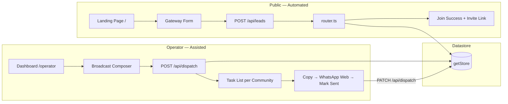
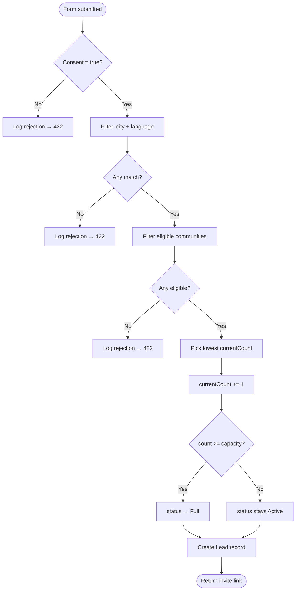
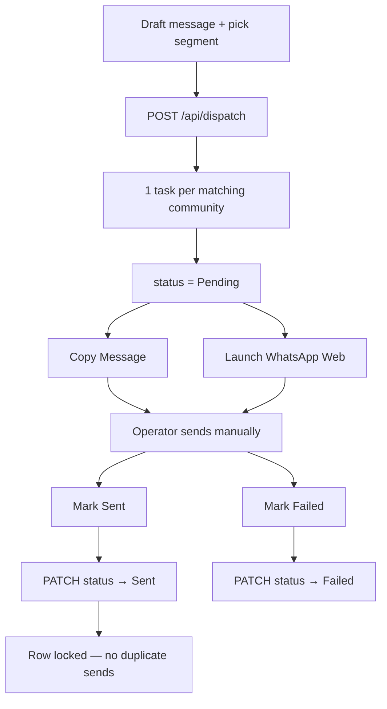

# Atlas Travels — WhatsApp Community Gateway

End-to-end product documentation for Project C (Atlas Travels MVP). This document explains how the system works from a pilgrim landing on the public gateway through operator-assisted broadcasts, including every routing and dispatch scenario the prototype handles.

**Core rule:** There is no compliant WhatsApp Communities API. Routing and task generation are fully automated. Community creation and message broadcasting are **assisted, human-in-the-loop** workflows only. No browser bots or unofficial automation exist in this build.

---

## What the product does

Atlas Travels (Hajj & Umrah) runs many private WhatsApp Communities segmented by **city** and **language**. Instead of sharing dozens of invite links, they publish **one smart gateway URL**. Each visitor fills a form, gets routed to the best available community, and taps a native WhatsApp invite link. Operators broadcast messages to multiple communities from a dashboard — but send each message manually via WhatsApp Web.

| Actor | Goal | How the MVP supports it |
|-------|------|-------------------------|
| **Pilgrim / lead** | Join the right community for their city & language | Public form → deterministic router → invite link |
| **Atlas operator** | Send one message to many communities safely | Compose broadcast → task list → manual send → mark status |
| **Admin / evaluator** | Prove capacity limits and compliance boundary | Dev simulation panel + rejection audit log |

---

## System architecture

Two parallel pipelines share one in-memory datastore:



### Compliance boundary

| Automated (compliant) | Assisted / manual (required) | Not in this build |
|----------------------|-------------------------------|-------------------|
| Landing form + consent | Creating WhatsApp Communities | Browser bots / scrapers |
| Segment + capacity router | Copy message → send in WhatsApp | Auto-creating communities |
| Lead + rejection logging | Proxy vs real count reconciliation | Auto-broadcasting |
| Dispatch task generation | Mark Sent / Failed per row | Reading live member counts |

---

## Data model

All state lives in a singleton in-memory store (`src/lib/datastore.ts`), seeded from `src/data/seed.json`. Data resets when the Next.js server restarts.

### Communities

```ts
{
  id, name, city, language,
  proxyCapacity,   // max proxy members before "Full"
  currentCount,    // routed-user proxy count (not live WhatsApp count)
  inviteLink,      // native WhatsApp invite URL
  status           // 'Active' | 'Full' | 'Privacy Risk'
}
```

### Leads

```ts
{
  id, name, phone, city, language,
  consented,           // must be true to route
  routedCommunityId,   // set on success; null on rejection
  timestamp
}
```

### DispatchTasks

```ts
{
  id, messageText, targetSegment,  // e.g. "city:Mumbai"
  status,                          // 'Pending' | 'Sent' | 'Failed'
  communityId, createdAt
}
```

### RejectedRoutingAttempts

```ts
{
  id, name, phone, city, language,
  reason, timestamp
}
```

### Seed communities (starting state)

| Community | City | Language | Count / Capacity | Status | Role in demo |
|-----------|------|----------|------------------|--------|--------------|
| Mumbai Hajj & Umrah | Mumbai | Hindi | 28 / 50 | Active | Primary Mumbai segment |
| Mumbai Umrah Pilgrims | Mumbai | Hindi | 12 / 40 | Active | Fallback when primary fills |
| Delhi Hajj Community | Delhi | Urdu | 19 / 45 | Active | Urdu segment |
| Hyderabad Umrah Group | Hyderabad | Telugu | 8 / 35 | Active | Telugu segment |
| Chennai Hajj Pilgrims | Chennai | Tamil | 30 / 30 | **Full** | Always skipped |
| Bangalore Umrah Community | Bangalore | Kannada | 14 / 25 | **Privacy Risk** | Always skipped |

---

## Pipeline 1 — Public gateway (user ingestion & routing)

### Step-by-step flow

1. User opens **`/`** — branded Hajj & Umrah landing page.
2. User fills **GatewayForm**: Full Name, WhatsApp Number, City, Language.
3. User must check the **consent checkbox** (mandatory opt-in).
4. Form submits **`POST /api/leads`** with the payload.
5. **`routeLead()`** in `src/lib/router.ts` runs deterministically.
6. On success → **JoinSuccess** UI shows community name + **Join WhatsApp Community** button (native `inviteLink`).
7. On failure → inline error message; rejection logged to `rejectedRoutingAttempts`.



### Routing rules (deterministic)

| Rule | Value | Implementation |
|------|-------|----------------|
| Segment match | Exact `city` + `language` (case-insensitive) | `router.ts` filter |
| Capacity buffer | `5` | `PROXY_CAPACITY_BUFFER` in `constants.ts` |
| Eligible threshold | `currentCount < proxyCapacity - 5` | `isEligible()` |
| Skipped statuses | `Full`, `Privacy Risk` | `isEligible()` |
| Best match | Lowest `currentCount` among eligible | Load balancing |
| Auto-mark Full | When `currentCount >= proxyCapacity` after increment | `routeLead()` |

**Example thresholds from seed data:**

- Mumbai Hajj (50 cap): accepts until count **44** (50 − 5)
- Mumbai Umrah (40 cap): accepts until count **35**
- Chennai (Full, 30/30): never eligible regardless of count

---

## Routing scenarios (all cases)

### Scenario A — Successful route (single match)

**Input:** Delhi, Urdu, consent ✓  
**Matching communities:** 1 (Delhi Hajj Community)  
**Eligible:** Yes (19 < 40)  
**Result:** Routed to `comm-delhi-urdu-01`, count 19 → 20, lead logged, invite link returned.

---

### Scenario B — Successful route (multiple matches, load balancing)

**Input:** Mumbai, Hindi, consent ✓  
**Matching communities:** 2 (both Active)  
**Eligible:** Both (28 < 45, 12 < 35)  
**Selection:** `comm-mumbai-hindi-02` wins (lower count: 12 vs 28)  
**Result:** Count 12 → 13, lead logged, invite link for Mumbai Umrah Pilgrims returned.

This is the default happy path for the most common segment in the demo.

---

### Scenario C — Fallback when primary community fills

**Input:** Mumbai, Hindi, consent ✓ (repeated until primary is near cap)  
**Behaviour:**

1. Router always picks the community with the **lowest** `currentCount`.
2. As `comm-mumbai-hindi-02` fills (approaches 35), traffic shifts to `comm-mumbai-hindi-01`.
3. When both are at or above `proxyCapacity - 5`, routing fails (Scenario F).

**Use the dev Simulation Panel** (`Simulate Capacity Overflow`) to inject 10 dummy Mumbai/Hindi leads and observe fallback + eventual rejections.

---

### Scenario D — Rejection: consent not provided

**Input:** Any city/language, `consented: false`  
**Result:**

- HTTP **422**
- Error: *"Consent is required to join a community."*
- Rejection logged: *"Consent not provided — routing blocked for compliance"*
- No lead created, no counter incremented

---

### Scenario E — Rejection: no community for segment

**Input:** Lucknow + Bengali (or any city/language combo with zero seeded communities)  
**Result:**

- HTTP **422**
- Error: *"No community available for Lucknow (Bengali)…"*
- Rejection logged: *"No community found for Lucknow / Bengali"*

The form offers 7 cities and 7 languages, but only 6 communities exist in seed data — unmatched combinations always fail gracefully.

---

### Scenario F — Rejection: all matching communities at capacity

**Input:** Mumbai, Hindi — after both communities hit `currentCount >= proxyCapacity - 5`  
**Result:**

- HTTP **422**
- Error: *"All communities in your segment are currently full…"*
- Rejection logged: *"All matching communities at or near proxy capacity"*

Neither community is selected; proxy counters unchanged for this attempt.

---

### Scenario G — Rejection: community marked Full

**Input:** Chennai, Tamil, consent ✓  
**Matching communities:** 1 (Chennai Hajj Pilgrims)  
**Status:** `Full` (30/30)  
**Result:**

- Community skipped by `isEligible()` (status check)
- Falls through to Scenario F — no eligible communities
- Rejection logged with capacity reason

---

### Scenario H — Rejection: community flagged Privacy Risk

**Input:** Bangalore, Kannada, consent ✓  
**Matching communities:** 1 (Bangalore Umrah Community)  
**Status:** `Privacy Risk`  
**Result:**

- Community skipped regardless of count (14/25 would otherwise fit)
- Rejection logged: *"Matching communities flagged Privacy Risk — routing suspended"*
- HTTP **422** with full-segment error message

**Product intent:** Operator flags a community when member visibility or moderation issues arise; router stops sending new leads until manually resolved.

---

### Scenario I — Auto-promotion to Full after successful route

**Input:** Any eligible community where increment pushes `currentCount >= proxyCapacity`  
**Behaviour:**

- Route succeeds (increment happens first)
- Community `status` set to **`Full`**
- Subsequent leads for that segment skip this community

**Example:** Hyderabad community at 34/35 routes one more user → count 35, status → Full.

---

### Scenario J — Missing or invalid form fields

**Input:** Empty name, phone, city, or language  
**Result:**

- HTTP **400** from API validation
- Error: *"All fields are required."*
- No routing attempted, nothing logged

---

### Routing outcome summary

| Scenario | HTTP | Lead created | Counter changed | Rejection logged |
|----------|------|--------------|-----------------|------------------|
| A — Single match success | 200 | ✓ | ✓ | — |
| B — Multi-match load balance | 200 | ✓ | ✓ (lowest count) | — |
| C — Fallback to alternate | 200 | ✓ | ✓ (other community) | — |
| D — No consent | 422 | — | — | ✓ |
| E — No segment match | 422 | — | — | ✓ |
| F — All at capacity | 422 | — | — | ✓ |
| G — Full status skipped | 422 | — | — | ✓ |
| H — Privacy Risk skipped | 422 | — | — | ✓ |
| I — Auto-mark Full | 200 | ✓ | ✓ + status → Full | — |
| J — Invalid payload | 400 | — | — | — |

---

## Pipeline 2 — Assisted dispatch (operator broadcasts)

### Step-by-step flow

1. Operator opens **`/operator`** — Operator Control Center.
2. Operator drafts a **message template** in Broadcast Composer.
3. Operator selects segment filter: **By City** or **By Language**, then picks a value.
4. Operator clicks **Generate Operator Task List** → **`POST /api/dispatch`**.
5. **`createDispatchTasks()`** finds all matching communities, creates **one Pending task per community**, sorted alphabetically by name.
6. For each task row, operator:
   - Sees community name + proxy count / capacity
   - Clicks **Copy Message** (clipboard)
   - Clicks **Launch WhatsApp** → opens `https://web.whatsapp.com/send?text=…` with pre-filled message
   - Manually sends in WhatsApp (outside the app)
   - Clicks **Mark Sent** or **Mark Failed**
7. Status update → **`PATCH /api/dispatch`** → visual feedback on row.



### Dispatch scenarios

#### Scenario K — Broadcast by city (Mumbai)

**Input:** Message + segmentType `city`, targetSegment `Mumbai`  
**Matching communities:** 2 (both Mumbai communities, all statuses)  
**Tasks created:** 2 rows — one for Mumbai Hajj & Umrah, one for Mumbai Umrah Pilgrims  
**Note:** Dispatch does **not** filter by Active/Full/Privacy Risk — operator may still need to message a Full community for existing members.

---

#### Scenario L — Broadcast by language (Hindi)

**Input:** Message + segmentType `language`, targetSegment `Hindi`  
**Matching communities:** 2 (both Mumbai Hindi communities)  
**Tasks created:** 2 rows

---

#### Scenario M — Broadcast with no matching communities

**Input:** Message + targetSegment `Bengali` (language filter)  
**Matching communities:** 0  
**Tasks created:** Empty list — operator sees *"No dispatch tasks yet"*

---

#### Scenario N — Mark Sent (success path)

**Action:** Operator clicks **Mark Sent** on a Pending task  
**Result:** Task status → `Sent`, row visually dimmed, **Mark Sent / Mark Failed disabled**  
**Duplicate prevention:** Once Sent, status cannot change to Failed

---

#### Scenario O — Mark Failed

**Action:** Operator clicks **Mark Failed** on a Pending task  
**Result:** Task status → `Failed`, row stays actionable (can retry manually if needed)  
**Use case:** WhatsApp Web failed, wrong community, message rejected by admin

---

#### Scenario P — Attempt to change Sent → Failed

**Action:** PATCH with `status: Failed` on already-Sent task  
**Result:** Status unchanged (locked), no error thrown — idempotent guard in `updateTaskStatus()`

---

#### Scenario Q — Multiple broadcasts accumulate

**Behaviour:** Each compose action **prepends** new tasks to `dispatchTasks`. Previous Sent/Failed tasks remain in the list for audit. Operator sees full history ordered newest-first.

---

### Dispatch outcome summary

| Scenario | Tasks created | Operator action | Final status |
|----------|---------------|-----------------|--------------|
| K — City filter | 1 per matching city community | Manual send | Sent / Failed |
| L — Language filter | 1 per matching language community | Manual send | Sent / Failed |
| M — No match | 0 | — | — |
| N — Mark Sent | — | Click Mark Sent | Sent (locked) |
| O — Mark Failed | — | Click Mark Failed | Failed |
| P — Re-mark Sent task | — | Blocked | Sent (unchanged) |
| Q — Repeat broadcast | New tasks added | Per row | Mixed |

---

## Pipeline 3 — Simulation & edge testing (dev only)

Visible on **`/operator`** when `NODE_ENV === development``.

### Scenario R — Simulate Capacity Overflow

**Action:** Click **Simulate Capacity Overflow**  
**API:** `POST /api/simulate` with `{ city: "Mumbai", language: "Hindi", count: 10 }`  
**Behaviour:**

1. Registers 10 dummy leads (`SimUser 1` … `SimUser 10`) through the real `routeLead()` function.
2. Each routes to lowest-count eligible community (typically `comm-mumbai-hindi-02` first).
3. When both Mumbai Hindi communities hit capacity threshold, remaining attempts reject.
4. Panel shows **routed / rejected counts** and live **Rejected Routing Log**.

**Production:** `POST /api/simulate` returns **403** — endpoint disabled outside development.

---

## API reference

| Method | Route | Purpose | Key file |
|--------|-------|---------|----------|
| POST | `/api/leads` | Route a lead | `api/leads/route.ts` |
| GET | `/api/communities` | Full datastore snapshot | `api/communities/route.ts` |
| POST | `/api/dispatch` | Generate operator tasks | `api/dispatch/route.ts` |
| PATCH | `/api/dispatch` | Update task status | `api/dispatch/route.ts` |
| GET | `/api/dispatch` | List all tasks (with community data) | `api/dispatch/route.ts` |
| POST | `/api/simulate` | Inject dummy leads (dev only) | `api/simulate/route.ts` |
| GET | `/api/simulate` | Fetch rejection log (dev only) | `api/simulate/route.ts` |

### POST `/api/leads` — request & response

**Request:**
```json
{
  "name": "Ahmed Khan",
  "phone": "+919876543210",
  "city": "Mumbai",
  "language": "Hindi",
  "consented": true
}
```

**Success (200):**
```json
{
  "success": true,
  "lead": { "id": "...", "routedCommunityId": "comm-mumbai-hindi-02", ... },
  "community": { "name": "...", "inviteLink": "https://chat.whatsapp.com/...", ... }
}
```

**Failure (422):**
```json
{
  "success": false,
  "error": "All communities in your segment are currently full..."
}
```

---

## User journeys (end-to-end narratives)

### Journey 1 — New pilgrim joins (happy path)

1. Pilgrim sees Atlas Travels landing page with Hajj & Umrah branding.
2. Enters name, WhatsApp number, selects Mumbai + Hindi, checks consent.
3. Router assigns them to Mumbai Umrah Pilgrims (lowest count).
4. Success screen shows **Join WhatsApp Community** button.
5. Pilgrim taps link → WhatsApp opens native invite → joins manually.
6. Lead appears in datastore with `routedCommunityId` and timestamp.

**Automated:** steps 2–4, 6. **Manual:** step 5 (user action in WhatsApp app).

---

### Journey 2 — Pilgrim in suspended segment

1. Pilgrim selects Bangalore + Kannada, checks consent.
2. Router finds Bangalore community but status is Privacy Risk → skipped.
3. Error shown on form; rejection logged with reason.
4. Atlas support must follow up offline (out of MVP scope).

---

### Journey 3 — Operator sends Umrah package update

1. Operator opens `/operator`.
2. Drafts: *"Assalamualaikum! July Umrah packages now open — reply for details."*
3. Filters by City → Mumbai → generates 2 tasks.
4. For each row: Copy Message → Launch WhatsApp → paste/send in community → Mark Sent.
5. Both tasks show green Sent status; duplicate send prevented.

**Automated:** task generation, status tracking. **Manual:** every WhatsApp send.

---

### Journey 4 — QA validates capacity routing

1. Developer opens operator dashboard in dev mode.
2. Clicks **Simulate Capacity Overflow** (10 Mumbai/Hindi leads).
3. Observes routed count, then rejections in log as capacity exhausts.
4. Confirms router switched between Mumbai communities before failing.

---

## What's mocked vs production

| Component | MVP (mocked) | Production target |
|-----------|--------------|-------------------|
| Invite links | Placeholder URLs | Real WhatsApp invite links from operator |
| Member counts | Proxy `currentCount` | Hand-reconciled against actual community size |
| Datastore | In-memory, resets on restart | Postgres + admin CRUD |
| Operator auth | Open `/operator` | Login / role-based access |
| Opt-out / suppression | Not implemented | Suppression list + consent audit |
| Community creation | Manual outside app | Assisted workflow in operator dashboard |

---

## File map (where logic lives)

```
src/
├── app/
│   ├── page.tsx                 Public landing + form + success state
│   ├── operator/page.tsx        Operator dashboard route
│   └── api/
│       ├── leads/route.ts       POST — route lead
│       ├── dispatch/route.ts    POST/PATCH/GET — broadcast tasks
│       ├── communities/route.ts GET — datastore snapshot
│       └── simulate/route.ts    POST/GET — dev overflow test
├── components/
│   ├── GatewayForm.tsx          Ingestion form + consent
│   ├── JoinSuccess.tsx          Post-route invite CTA
│   ├── OperatorDashboard.tsx    Control center shell
│   ├── DispatchTaskList.tsx     Ordered task queue
│   ├── DispatchTaskRow.tsx      Copy / Launch / Mark actions
│   └── SimulationPanel.tsx      Dev-only edge testing
├── lib/
│   ├── router.ts                Deterministic routing engine
│   ├── dispatch.ts              Task generation + status updates
│   ├── datastore.ts             Singleton store
│   ├── constants.ts             Buffer, cities, languages
│   └── types.ts                 TypeScript interfaces
└── data/seed.json               Initial mock data
```

---

## Running the MVP

```bash
cd proj3
npm install
npm run dev
```

| URL | Purpose |
|-----|---------|
| http://localhost:3000 | Public gateway |
| http://localhost:3000/operator | Operator dashboard |
| `pipeline_flowchart.html` | Visual pipeline (open in browser) |

---

## Related documents

- **`README.md`** — Quick start and compliance summary
- **`pipeline_flowchart.html`** — Mermaid diagrams for team sharing

---

*Atlas Travels · Project C · 360 Labs Product & Growth Work Test*
